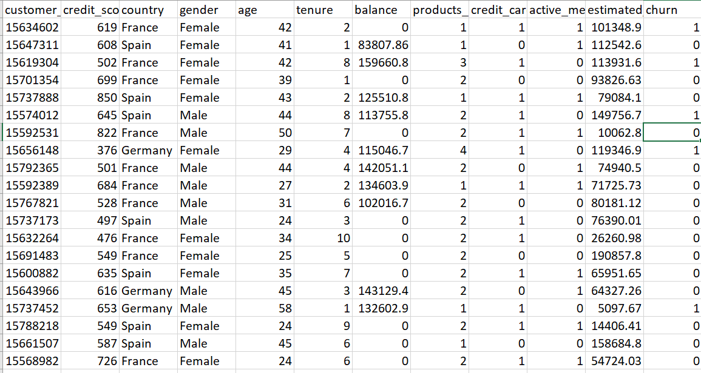
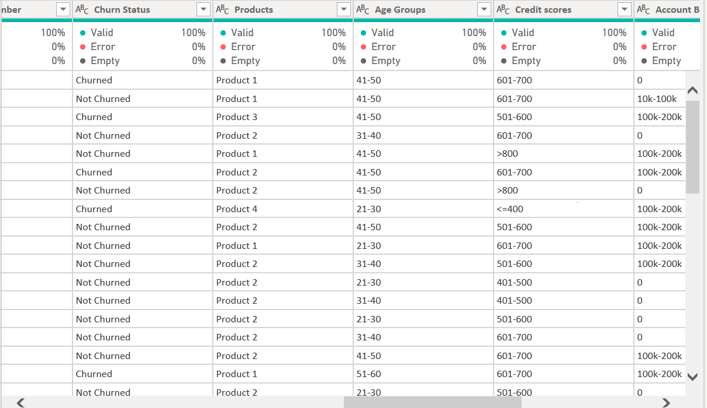
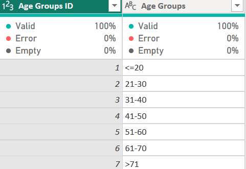
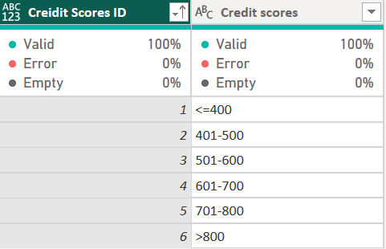
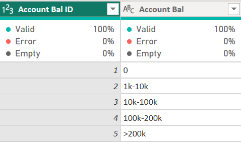
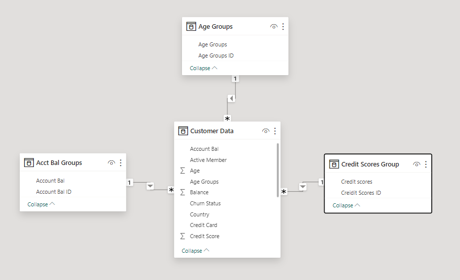
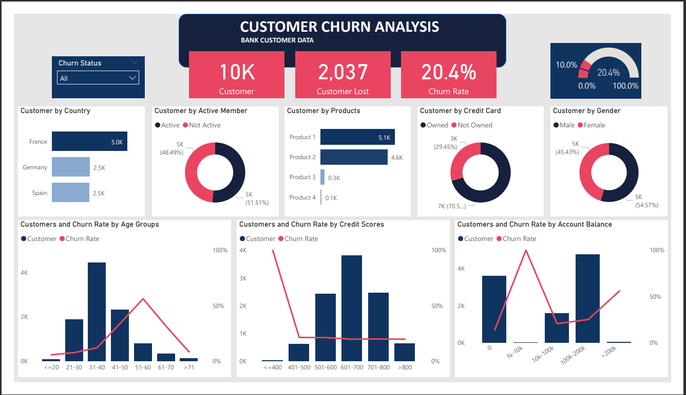

# Customer Churn Analysis


## Introduction
Customer churn, also known as customer attrition or customer turnover, refers to the phenomenon where customers cease their relationship with a business or service provider. It is a crucial metric for companies across various industries as retaining existing customers is generally more cost-effective than acquiring new ones.

## Problem Statement
Our organization is struggling with customer churn due to the absence of real-time visibility into customer behavior and engagement.
Without timely insights, our retention efforts are reactive rather than proactive. 
As a data analst you are to develop a comprehensive dashboard that provides real-time analytics on customer interactions, enabling the team to identify potential churn risks promptly and implement targeted retention strategies.

## Tools
Microsoft Power BI was used to clean  and transform the data and also used to build the dashboard

## Data Source
The dataset used for this project can be download [here](https://drive.google.com/file/d/17bUJhEkQEDmoyLZ88TyS_Pi2IRcRMfAg/view?pli=1). 

## Meta Data
The dataset contains 10000 rows of data and 12 columns. The columns store the following data 
- Customer_id : Id of the customers
- Credit_score : credit scores of customer based on their purchase
- Country : countries of the customers
- Gender : customers gender
- Age : customers age
- Tenure : duration of customer in the organisation
- Balance : customers account balance
- Products : product purchased or used by the customers
- Credit_card : customer credit card status
- Active member : customer activity status
- Estimated salary : salary estimated that the custumer earned
- Churn : customer churn status

## Data Cleaning and Transformation
After downloading the data it was loaded into power query in Power BI for data cleansing and transformation. 
Power query is a tool used for extracting, transforming and loading data (ETL tool).

After loading the dataset null and duplicates values was checked and removed and also the data type was changed to the right format.
Columns not needed for the analysis was dropped i.e (Estimated salary) column and some conditional columns was added to transform the data into useful format for analysis.
- Credit card column contains the values 1 and 0 which was replaced with **Owned** and **Not Owned**. 1 was mapped to **Owned** and 0 mapped to **Not Owned**
- Active member column contains the values 1 and 0 which was replaced with **Active** and **Not Active**. 1 was mapped to **Active** and 0 mapped to **Not Active**
- Churn status column contains vaues 1 and 0 which was replaced with **Churned** and **Not Churned**. 1 was replaced with **Churned** and 0 replaced with **Not Churned**
- A new conditional column (Age_Group) was created using the **Age column**.
- A new conditional column (Credit_Scores) was created using the the **credit score** column.
- A new conditional column (Account_Balance) was created using the **Balance** column.

To sort the conditional columns created, new tables were created namely **Age_group**, **Credit_score_group** and **Account_balance_group**

Data before transformation              |              After transformation
:--------------------------------------:|:---------------------------------:
          | 

Age_group              |              Credit_score              |          Account_balance
:---------------------:|:--------------------------------------:|:----------------------------:
     |                   |  

## Data modelling 

Initially the dataset is a single file but because of the 3 tables that were created, there is a need to create a relationship betweeen the them.



The data model created is a star schema

## DAX Measures
Data Analysis Expressions (DAX) is a programming language used for creating calculated columns, measures, and custom tables in Power BI.

- Total customers
  ```
  Total Customer = COUNT('Customer Data'[Customer ID])
  ```
- Customer Lost (Churned)

  ```
  Customer Lost = CALCULATE(COUNT('Customer Data'[Churn Status]), 'Customer Data'[Churn Status]= "Churned")
  ```
- Churn Rate
  
  ```
  Churn Rate = DIVIDE([Customer Lost],[Customer],0)
  ```


## Dashboard




Interact with the dashboard [here](https://app.powerbi.com/view?r=eyJrIjoiYWMwOGVjNTUtYmU0OC00YWY1LTk0NzEtM2NiZTdkYTEyMjRmIiwidCI6IjY2YzIxYTZiLTI2YzctNDNiYy04Mzg5LTMyYjhjMmU5MWRjZiJ9)

## Insights
1. There is a total of 10,000 customers in the organization
2. The number of churned customers is 2,047
3. Churned rate is 20.4%
4. The country with the highest customers is France with a total of 5,014 customers
5. Product 1 was the most purchased product with over 5000+ customers purchasing it
6. The age group 51-60 has the highest churn rate
7. Customers with credit scores less than 400 churned the most
8. Customers with credit card churn more than customers without credit card
9. 


## Recommendations 
1. From analysis it was observed that customers with credit cards churn more than customers without credit card. This may be due to one of the following reasons :
   
- **High Fees and Interest Rates** : Customers may be dissatisfied with the bank's credit card fees and high-interest rates.
  
  **Solution** : The bank could consider revisiting its fee structure, offering more competitive interest rates, or introducing perks to offset costs.
  
- **Competitive Offerings** : Customers may receive more attractive offers from competing banks, such as lower interest rates, better rewards, or introductory promotions.

  **Solution** : Regularly reviewing and adjusting credit card offerings to remain competitive in the market can help retain customers.

- **Security Concerns** : Instances of fraud, data breaches, or inadequate security measures can erode customer trust and prompt them to seek more secure options.

    **Solution** : Strengthening security measures, implementing fraud detection systems, and transparently communicating security efforts can help address these concerns.

2. It was also observed that customers between the age range of 51-60 had the highest churn rate. This may be due to one of the following factors :

- **Retirement and Financial Planning** : Customers in this age range might be entering retirement, leading to changes in their financial needs and priorities.

  **Solution** : The bank can offer specialized retirement planning services, investment options, and financial advisory services to cater to the unique needs of customers transitioning to retirement.

- **Technology Adoption and Digital Services** : Some customers in this age group may feel overwhelmed or dissatisfied with the bank's digital services, especially if they are not user-friendly.

  **Solution** : Offering user-friendly digital banking interfaces, providing educational resources on digital banking, and offering in-person assistance can help ease the transition to digital services.

- **Health and Mobility Issues** : Health concerns or limited mobility may influence banking preferences, leading customers to seek more accessible or specialized banking services.
  
  **Solution** : Offering home banking services, specialized assistance for customers with mobility issues, or partnerships with local community services can enhance accessibility.


